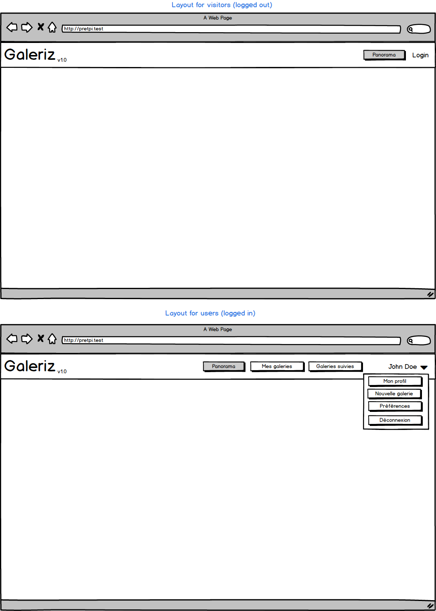

## Documentation

### MCD

### Available pages:

- All galleries: under menu section called `Panorama`
- Gallery details: all pictures in the gallery and the name of the author
- Author details: information about the author and a list of the associated categories
- Create a gallery: Create a new gallery without any picture
- Manage gallery's pictures: Upload new pictures, manage titles, delete existing ones and browse current pictures.

## Models
### Layout

### All galleries

### Gallery details

### Login

