# Galeriz Documentation

## First analysis
### Introduction
Galeriz is a galleries publishing web applicaiton. Authors can publish galleries of images, manage their images, choose cover image for each gallery, add titles, and follow other galleries. Everyone can see the galleries and their images, only authenticated users can manage images and galleries.

**Table of content**:
- [Galeriz Documentation](#galeriz-documentation)
  - [First analysis](#first-analysis)
    - [Introduction](#introduction)
    - [Goals](#goals)
    - [Initial planning](#initial-planning)
  - [Analysis/Design](#analysisdesign)
    - [Architecture](#architecture)
    - [Available pages](#available-pages)
    - [Database](#database)
      - [MCD](#mcd)
      - [MLD](#mld)
    - [Models](#models)
      - [Layout](#layout)
      - [Login](#login)
      - [Register](#register)
      - [All galleries](#all-galleries)
      - [Create a gallery](#create-a-gallery)
      - [Gallery details](#gallery-details)
      - [Gallery edition](#gallery-edition)
    - [Tests](#tests)
      - [Where are these tests ?](#where-are-these-tests-)
      - [Tests coverage](#tests-coverage)
      - [Tests results](#tests-results)
      - [Prerequesite to run tests ?](#prerequesite-to-run-tests-)
      - [How to run tests ?](#how-to-run-tests-)
    - [Planification](#planification)
    - [Design elements](#design-elements)
  - [Realisation](#realisation)
    - [Repository structure](#repository-structure)
  - [Appendix](#appendix)
    - [Pre-TPI summary](#pre-tpi-summary)
    - [Work diary](#work-diary)
    - [Installation manual](#installation-manual)
    - [Project source code](#project-source-code)
    - [Icons](#icons)

### Goals
Implement the following features in a web application using PHP, Javascript and MySQL.

General features.
1. Account creation
1. Authentication
   
As visitor (logged out)
1. See the list of galleries
1. See the images inside galleries

As user (logged in)
1. Possibility to follow a gallasdfery
1. Display a list of followed galleries
1. Create a new gallery with a custom name
1. Add images in a gallery
1. Delete an image in a gallery
1. Display the profile of a user

### Initial planning
The project starts the 01.02.2022 and finishes the 28.03.2022. The planning consist of 7 sprints where every sprint is 1 week long. (I'm not using Scrum, but I use the concept of sprints as parts of the project).  
The projects planning and tasks management is done with Github Issues and Github Projects. [It is visible here](https://github.com/samuelroland/galeriz/projects).

**Initial planning**:


## Analysis/Design

### Architecture
To develop faster, I have chosen a PHP framework called [Laravel](https://laravel.com) that I used during my first apprenticeship and for different personal projects at home. In addition to Laravel, I choose to use Livewire, which is a fullstack components framework for Laravel. It helps me create reactive frontend interactions without writing tons of AJAX requests and Javascript code. To avoid some useless requests in the backend just to change visibility of elements, I picked AlpineJS, which is a lightweight Javascript framework. To design my app without a lot of pure CSS, I imported TailwindCSS (a CSS framework).

This combination of these 4 frameworks is called [the TALL stack](https://tallstack.dev/) and is not unusual around the Laravel ecosystem. I chose Laravel 9 and not 8 because it's the latest one.

For the database I picked MySQL (as required) version 8.0.

### Available pages

- **All galleries**: all galleries published on Galeriz
- **My galleries**: galleries of the logged user
- **Followed galleries**: galleries followed by the logged suer
- **Create a gallery**: Create a new gallery without any picture
- **Gallery details**: all pictures in the gallery and the name of the author
- **Gallery edition**: Manage gallery details (title and description), upload new images, manage titles, delete existing images and browse current ones.
- **Profile page**: profile of authors on Galeriz

### Database
#### MCD
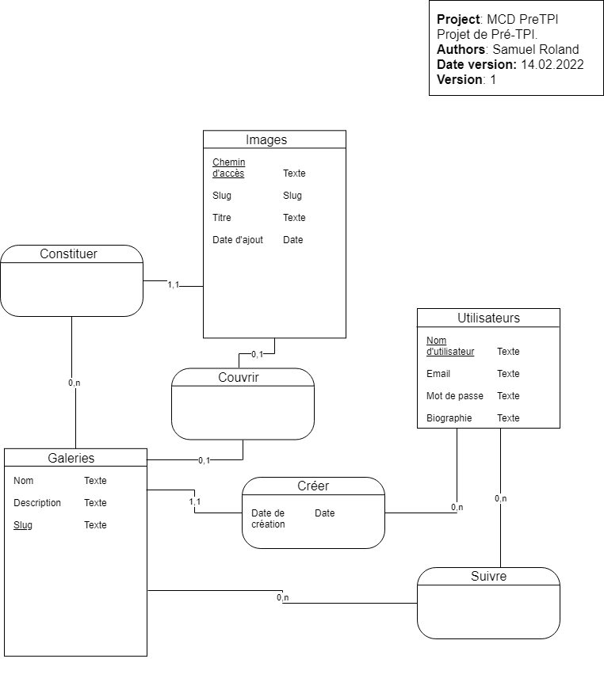
#### MLD
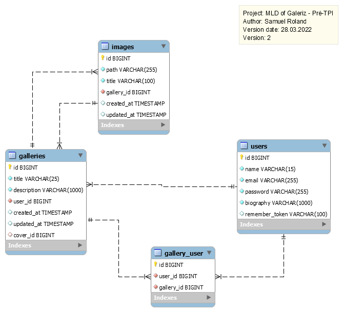

### Models
In addition to pages listed above, we have the Layout, Login and Register models too. (This is mostly designed by Jetstream).

#### Layout
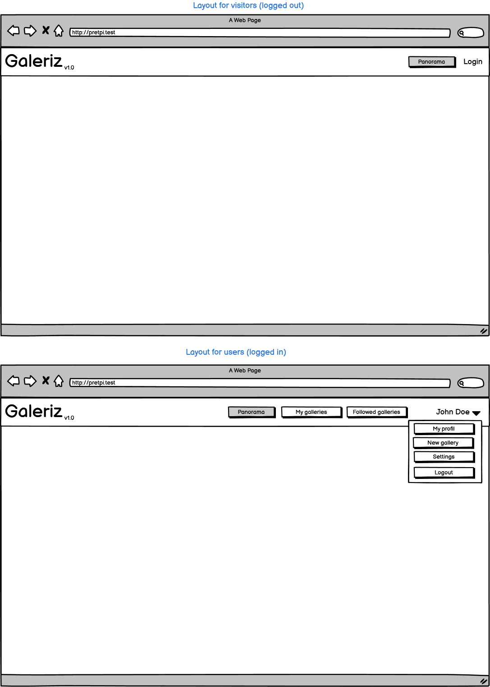

#### Login
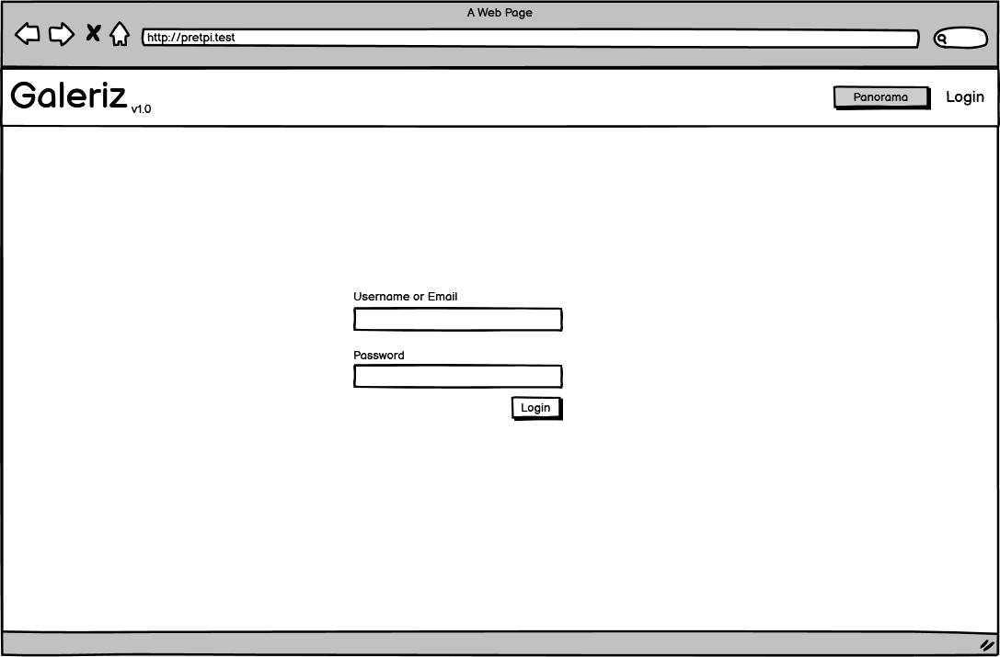

#### Register
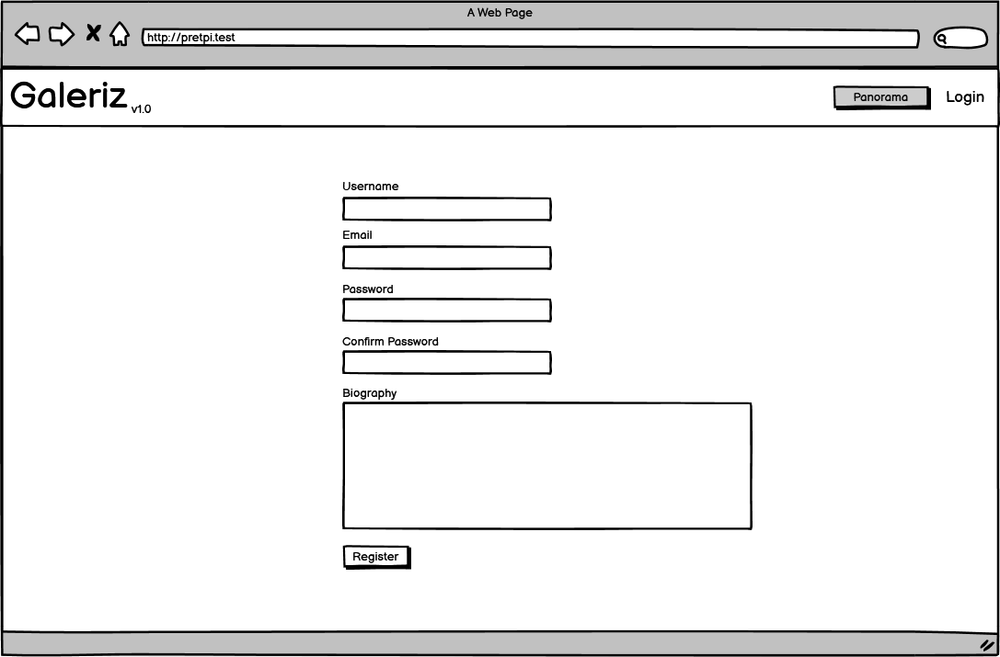

#### All galleries
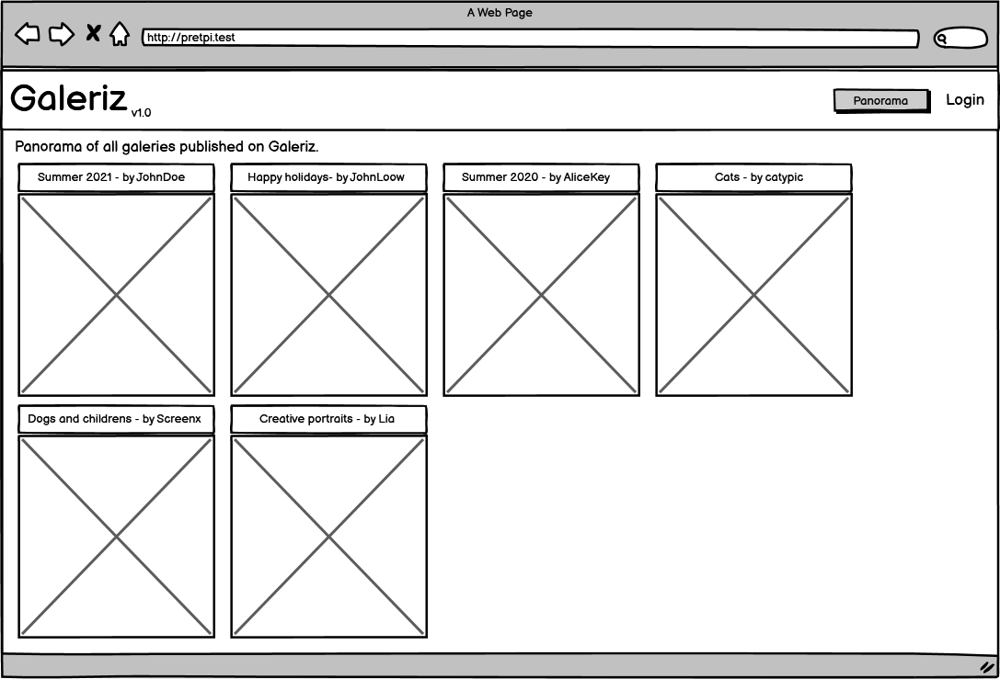

#### Create a gallery
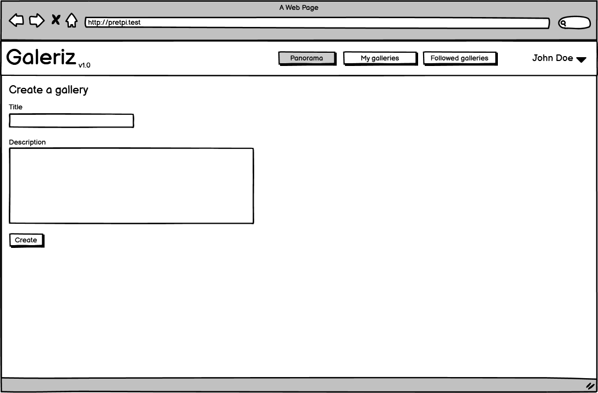

#### Gallery details
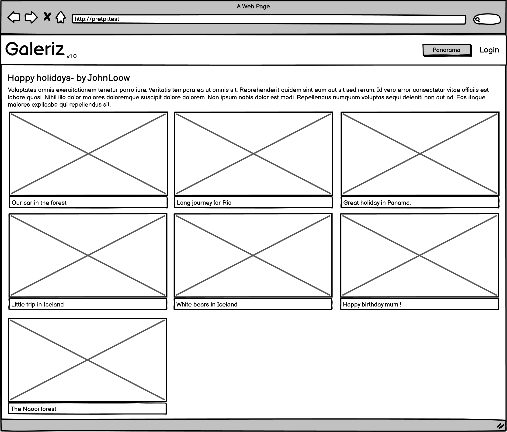

#### Gallery edition
Gallery title, images titles and descriptions are editable on double click (an input appears).
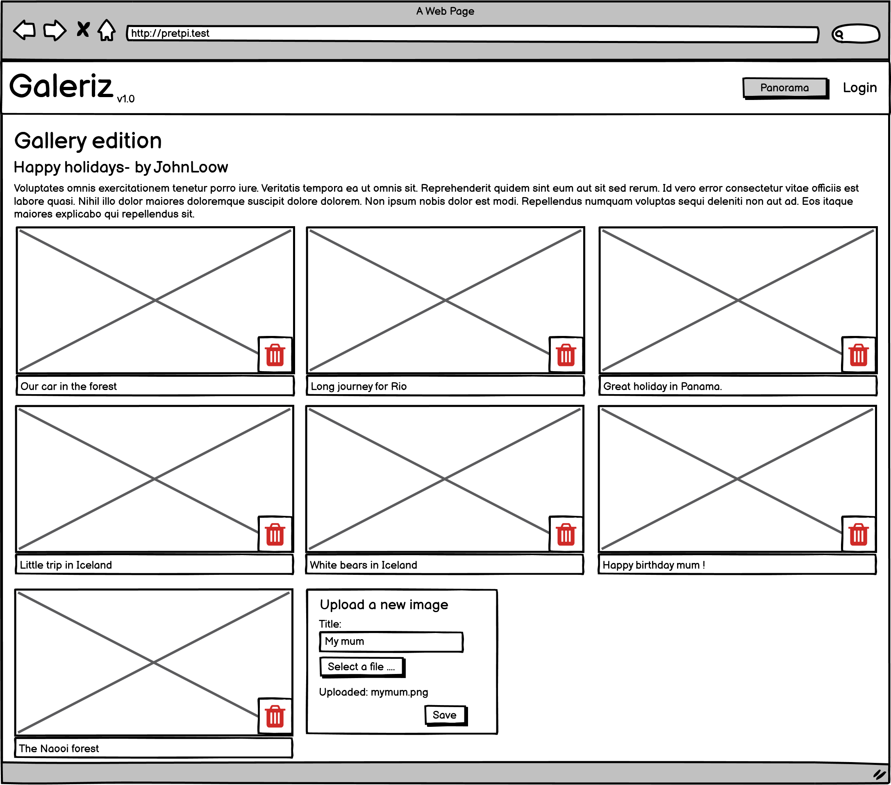

### Tests
This section concerns how Galeriz is tested manually and with automated tests. Samuel tests during the development in his browser. Most of the features and cases are tested with automated tests written with `phpunit` (a php testing framework). The testing strategy is simply to develop in BDD (Behavior Driven Development), so writing feature tests to check the behavior of features with given data and expected output, and then developing these features. Samuel tests manually during the development that everything works as expected in the frontend, especially things that he didn't test with automated tests. The entire test suite is runned very frequently.

#### Where are these tests ?
Everything is in the `tests` folder in the repository. The folder `Feature` contains all the feature tests. The folder `Unit` is not used because I didn't need to write unit tests.  
The folder `Jetstream` contains all the tests written by Jetstream (I moved from `Feature` to `Jetstream` because I wanted to avoid to run them each time I run the test suite). I wrote **38** feature tests to cover most of the features, some tests are missing (for image upload for ex.), but in this case I tested by hand too.

#### Tests coverage
As we are limited to the backend, I cannot test frontend interactions and Javascript code with automated tests. For most features, I tested that the page loads correctly, I tested the ideal case, and then I wrote data validation, disk file presence, ... I did not have time to write more tests on Image upload for data validations and other possible errors (upload fail, image type and size check, ...) so I tested it manually and it works.

Here is the complete list of tests. The names should helps to have an idea of how much it is tested.

**Tests\Feature\AllGalleriesTest**
- galleries page exists
- all galleries are visible
- all cover images are displayed

**Tests\Feature\FollowedGalleriesTest**
- followed galleries page exists
- followed galleries page is guarded
- it contains title and description

**Tests\Feature\GalleryCreationTest**
- create a gallery page exists
- gallery creation is guarded
- gallery creation creates a gallery with logged user
- gallery creation validates data

**Tests\Feature\GalleryDetailsTest**
- gallery details page without id redirects to panorama
- gallery details page exists
- gallery details page is displayed
- gallery details page display all images
- an image without file on disk has default not found image
- an image with empty path has default not found image
- a message is displayed when there is no image

**Tests\Feature\GalleryEditionTest**
- gallery edition page exists
- gallery edition page is guarded
- it redirects to gallery details if user is not the gallery owner
- edit button is not visible if user is not the gallery owner
- livewire gallery edition components are present on page
- gallery title can be edited
- gallery description can be edited
- title and description must be valid
- a message is displayed when there is no image
- image deletion deletes in db and on disk
- image is not deleted if is not in the current gallery
- image is not deleted if author is not the gallery owner
- cover image is set to null if deleted image is the cover

**Tests\Feature\LayoutTest**
- layout menu is correct when unlogged
- layout menu is correct when user is logged

**Tests\Feature\MyGalleriesTest**
- my galleries page exists
- my galleries page is guarded
- my galleries are all displayed
- has title and description
- display a message when no galleries exists

**Tests\Feature\UploadImageTest**
- image can be uploaded

#### Tests results

The tests runned the 28.03.2022 at 16:30 are all passing:
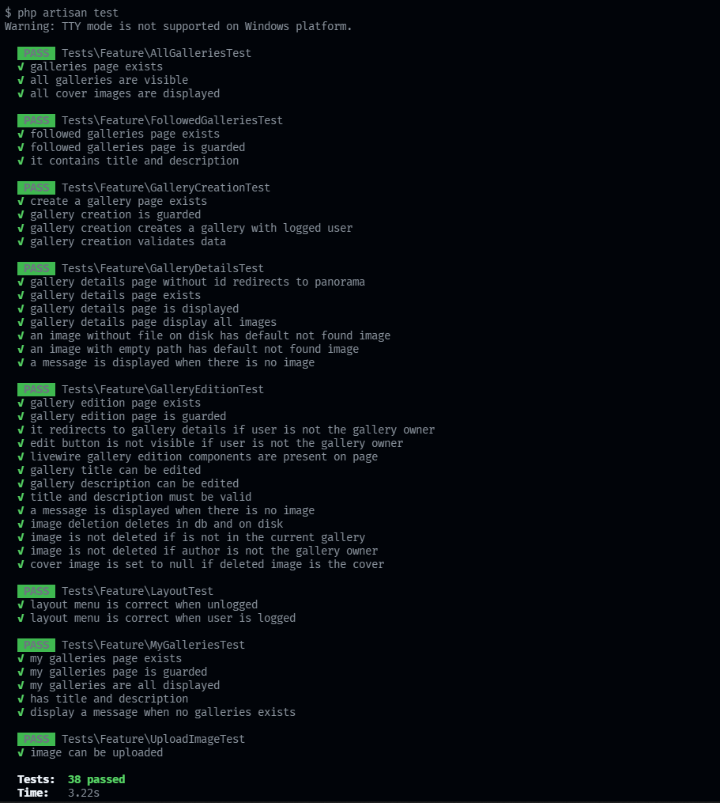

If you want to see the result of tests at the last commit or older ones, you can go on the [Actions tab](https://github.com/samuelroland/galeriz/actions) on the repository and see the lastest run of the `laravel.yml` workflow running all feature tests (only feature tests not the others).

#### Prerequesite to run tests ?
`phpunit` is a binary CLI pulled by composer, so you need to have pulled composer packages (`composer install`). As defined in the `phpunit.xml`, tests are runned against an in memory sqlite database. Each tests seed the database again with the default seeder.

This lines at the bottom of `phpunit.xml` (root of the repos), define 2 environment variables.
```xml
<env name="DB_DATABASE" value=":memory:"/>
<env name="DB_CONNECTION" value="sqlite"/>
```

You need the SQLite php extension too.

#### How to run tests ?
There are different ways to run the tests in your terminal:
- `./vendor/bin/phpunit`
- `php artisan test`

You can pass arguments to `phpunit` or (same arguments after the `php artisan test` command).

**Examples**:
- to execute only 1 test:  
`php artisan test --filter my_galleries_page_exists`
- to execute tests for a given class:  
 `php artisan test tests/Feature/AllGalleriesTest.php`

I recommend you to setup a shortcut in your IDE to run the tests. I used this keyboard shorcut setting in VSCode to run `php artisan test tests/Feature` on `ctrl+t ctrl+t`
```json
{
    "key": "ctrl+t ctrl+t",
    "command": "workbench.action.terminal.sendSequence",
    "args": {
        "text": "php artisan test tests/Feature\u000D"
    }
}
```

### Planification

Here is the final planning.

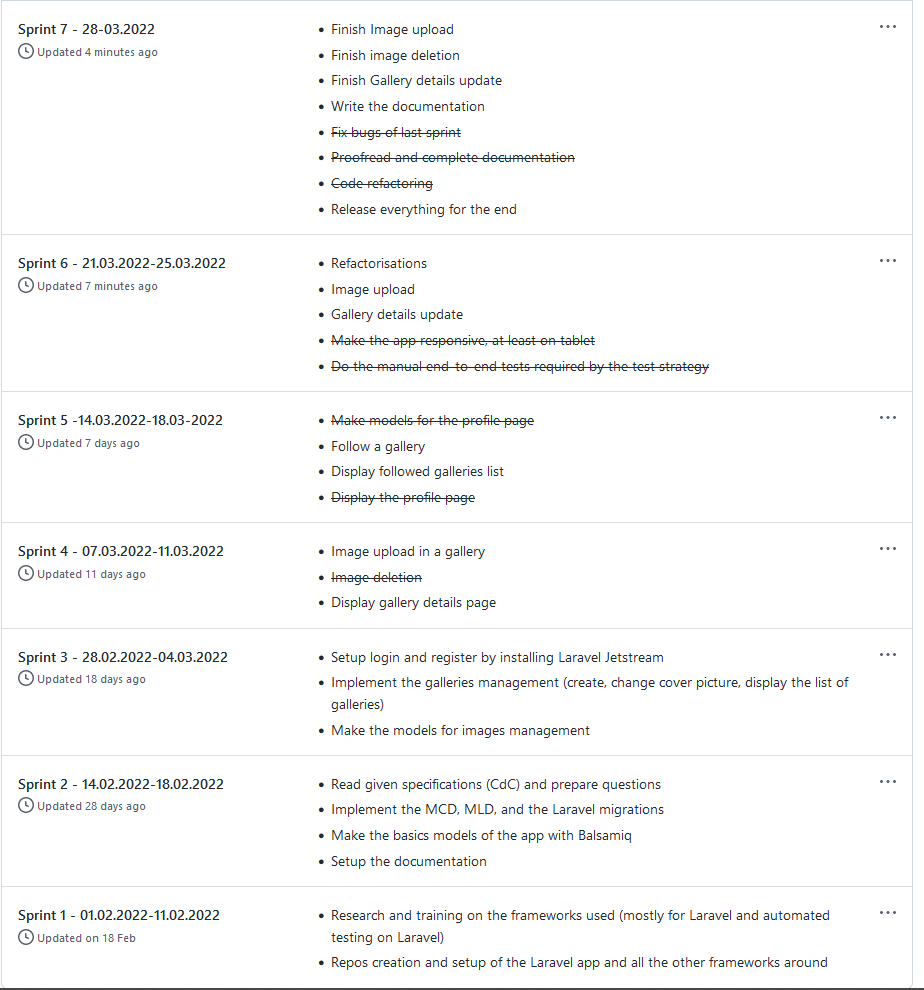

### Design elements

I used Balsamiq Wireframes with the CPNV licence to do my models.

I created a few reusable components:
- `field`: a reusable blade component to use as an input or textarea
- `btn` and `text-message`: css class to style buttons and texts for messages.

<!--
Fournir tous les document de conception:

•	le choix du matériel HW
•	le choix des systèmes d'exploitation pour la réalisation et l'utilisation
•	le choix des outils logiciels pour la réalisation et l'utilisation
•	site web: réaliser les maquettes avec un logiciel, décrire toutes les animations sur papier, définir les mots-clés, choisir une formule d'hébergement, définir la méthode de mise à jour, …
•	bases de données: décrire le modèle relationnel, le contenu détaillé des tables (caractéristiques de chaque champs) et les requêtes.
•	programmation et scripts: organigramme, architecture du programme, découpage modulaire, entrées-sorties des modules, pseudo-code / structogramme…

Le dossier de conception devrait permettre de sous-traiter la réalisation du projet !
 -->

## Realisation

### Repository structure
Most of the folders are the application folders. The `docs` folder contains the documentation material, `docs.md` (this documentation), the MCD and MLD export files, the WorkDiary.md, the exported models in `models`. `sources` contains the source file of the models, the MCD, and the MLD.
<!--

3.1	Dossier de réalisation

Décrire la réalisation "physique" de votre projet

•	les répertoires où le logiciel est installé
•	la liste de tous les fichiers et une rapide description de leur contenu (des noms qui parlent !)
•	les versions des systèmes d'exploitation et des outils logiciels
•	la description exacte du matériel
•	le numéro de version de votre produit !
•	programmation et scripts: librairies externes, dictionnaire des données, reconstruction du logiciel - cible à partir des sources.

NOTE : Evitez d’inclure les listings des sources, à moins que vous ne désiriez en expliquer une partie vous paraissant importante. Dans ce cas n’incluez que cette partie…

3.2	Description des tests effectués

Pour chaque partie testée de votre projet, il faut décrire:

•	les conditions exactes de chaque test
•	les preuves de test (papier ou fichier)
•	tests sans preuve: fournir au moins une description 

### Remaining errors

S'il reste encore des erreurs: 

•	Description détaillée
•	Conséquences sur l'utilisation du produit
•	Actions envisagées ou possibles

## Conclusion

Développez en tous cas les points suivants:

•	Objectifs atteints / non-atteints
•	Points positifs / négatifs
•	Difficultés particulières
•	Suites possibles pour le projet (évolutions & améliorations)

 -->
## Appendix

### Pre-TPI summary

The Pré-TPI went well for me, I develop most of the required features and they are mostly fully tested with automated tests.

**I poorly managed the redaction of this documentation and I have to release it half done sorry...**

<!--
5.2	Sources – Bibliographie

Liste des livres utilisés (Titre, auteur, date), des sites Internet (URL) consultés, des articles (Revue, date, titre, auteur)… Et de toutes les aides externes (noms)   
-->
### Work diary
I wrote the diary in a separated file under [docs/WorkDiary.md](/docs/WorkDiary.md)

### Installation manual
The installation steps are described in the README.
<!-- 
5.4	Manuel d'Installation

5.5	Manuel d'Utilisation

5.6	Archives du projet 
-->

### Project source code
Present [on Github](https://github.com/samuelroland/galeriz).

### Icons
All icons comes from [heroicons.com](https://heroicons.com/) and are licenced under MIT. I used them by copy paste.
