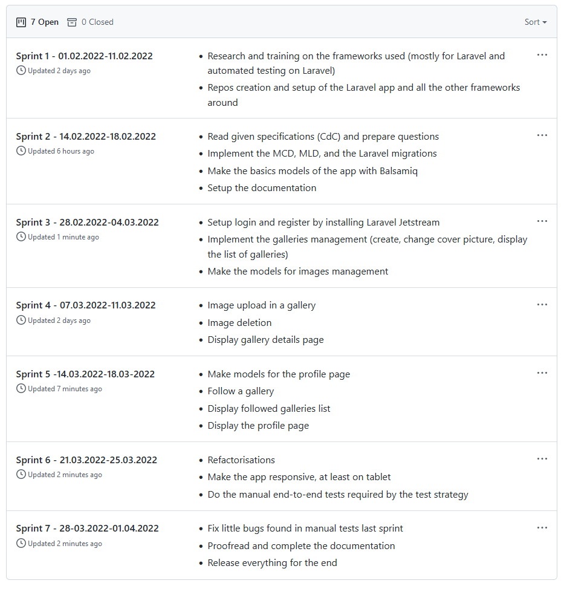
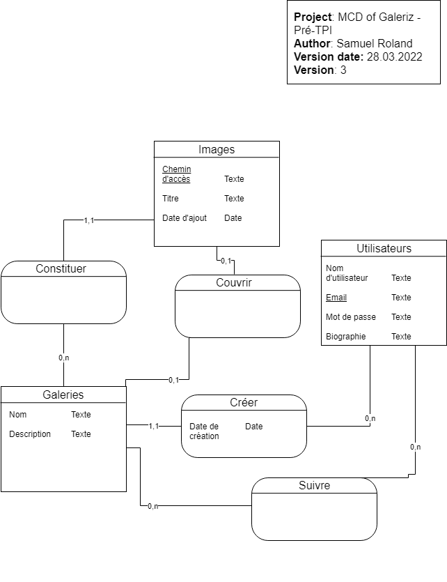

## Documentation

## Introduction
TODO

### Initial planning
The planning consist of 7 sprints where every sprint is 1 week long. (I'm not using Scrum, but I just use the concept of sprints as parts of the project).  
The projects planning and tasks management is done with Github Issues and Github Projects. [This planning is also available here](https://github.com/samuelroland/galeriz/projects).

### MCD

### MLD
coming soon...

## Available pages

- All galleries: under menu section called `Panorama`
- Gallery details: all pictures in the gallery and the name of the author
- Author details: information about the author and a list of the associated categories
- Create a gallery: Create a new gallery without any picture
- Manage gallery's pictures: Upload new pictures, manage titles, delete existing ones and browse current pictures.

## Models
### Layout

### All galleries

### Gallery details

### Login

